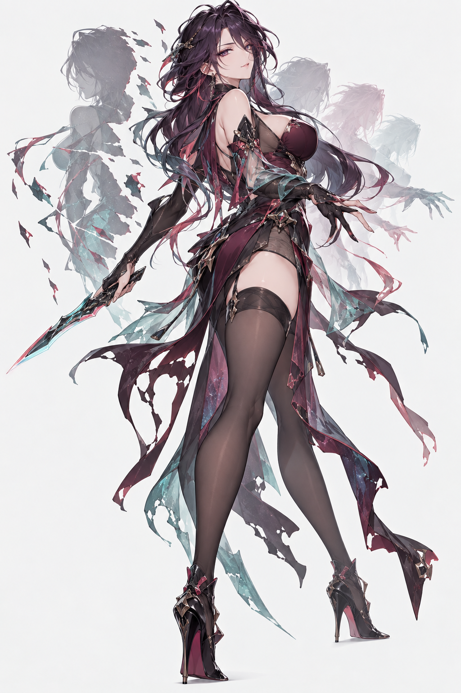

# Anime Character Director

**A Codex-native Skill for human-guided 2D anime gacha character design and art direction.**

From generic AI anime characters to human-guided, identity-driven gacha character design.

<table>
<tr>
<td align="center"><b>Before</b></td>
<td align="center"><b>After</b></td>
</tr>
<tr>
<td></td>
<td></td>
</tr>
<tr>
<td>Generic fantasy / browser-game drift,<br>3/4 twisted pose,<br>ornament-driven identity</td>
<td>Front-facing standee,<br>contemporary gacha design,<br>character-specific visual structure</td>
</tr>
</table>

## What problem it solves

Modern image models can render polished anime illustrations, but character design often converges toward generic anime faces, repeated white-hair/techwear templates, browser-game or MMORPG visual language, ornament density instead of identity, cinematic 3/4 poses instead of readable standees, and safe predictable concepts.

Anime Character Director adds a design layer before image generation. It is not a prompt expander. It guides possibility expansion, Character Direction exploration, Human selection, Art Direction exploration, Human mix/selection, contemporary gacha visual language, front-facing standee composition, and anime 2D style preservation.

## Codex expands. Human selects.

```text
User Idea
    ↓
5 Character Directions
    ↓
Human Select / Mix
    ↓
Character Planning
    ↓
4 Art Directions
    ↓
Human Select / Mix
    ↓
Final Visual Direction
    ↓
$imagegen
    ↓
S1 Anime 2D Hard Gate
    ↓
Human Review
```

AI does not automatically decide taste. Human owns selection, rejection, mixing, aesthetics, and the question: “would I pull this character?”

## Major design features

### Anime 2D Hard Gate

Preserves unmistakable 2D anime abstraction and avoids photorealism, semi-realistic drift, and 3D-render aesthetics.

### Human-Guided Creative Expansion

Interactive CREATE expands 4–6 Character Directions by defaulting to five, then presents 4–6 Art Directions by defaulting to four. It pauses at both Human selection checkpoints and does not silently choose taste.

### Front-Facing Character Standee

The main body stays frontal for standard character illustration. Dynamism comes from arms, hair, cloth, weapons, VFX, and secondary silhouettes instead of rotating the torso into an unreadable 3/4 pose.

### Contemporary Gacha Design Principle

Identity comes before pagegame luxury: macro shapes, head identity, costume architecture, detail islands, controlled color architecture, material hierarchy, and one primary iconic anchor. Adult sensuality remains available without using ornament stacking as a rarity signal.

### Structural Fantasy Design

Abilities enter silhouette, body, costume, negative space, and shape language instead of becoming only glow, crystals, shards, or generic VFX.

## Installation

This repository is itself the Skill root. Clone or download it into the user-level Codex Skills directory; do not add an extra `skills/anime-character-director/` nesting layer.

### Git clone

```powershell
git clone https://github.com/glt258/anime-character-director.git "$HOME\.codex\skills\anime-character-director"
```

On Windows, the equivalent explicit path is:

```powershell
git clone https://github.com/glt258/anime-character-director.git "C:\Users\<your-user>\.codex\skills\anime-character-director"
```

### Download ZIP

Download the repository ZIP, extract it, and place the extracted `anime-character-director` folder at `C:\Users\<your-user>\.codex\skills\anime-character-director` (or the user-level Skills directory used by your Codex installation).

## Quick start

```text
$anime-character-director

Design an original adult female anime gacha character.

I want:
- urban fantasy
- dangerous but elegant
- strong player appeal

Use interactive mode.
Do not choose the final direction for me.
```

The Skill stops after Character Explore until Human selection. After selection it stops again after Art Explore. Only the approved/mixed direction proceeds to Final Visual Direction and, when the host supports it, the existing local Runtime → PromptCompiler → built-in `$imagegen` path.

## Runtime and boundaries

This package is the reusable Codex Skill layer. It does not bundle the benchmark project's Python Runtime, schemas, policy files, tests, caches, private artifacts, external Agent, server, LLM API wrapper, image API, or ComfyUI pipeline. A host project may provide a local Runtime preflight; the Skill's creative behavior remains usable without copying the entire benchmark repository.

S1 Anime 2D Hard Gate remains the only current visual hard gate. The Commercial Gacha Profile is vocabulary and possibility expansion, not a second gate. After generation, present the image and stop for Human Review; do not automatically redesign, regenerate, optimize, or score commercial appeal.

## Image generation

Anime Character Director is designed to work with Codex built-in `$imagegen`. It does not require an external image API, ComfyUI, or an external Agent server. `$imagegen` is the renderer, not the Character Designer; character design happens before image generation.

## Current Status

Implemented: Anime 2D Hard Gate guidance; Human-guided Character and Art Direction expansion; Human selection and mixing; Front-Facing Character Standee guidance; Contemporary Gacha Design Principle; Macro-first design; Detail Islands; Color Architecture; Material Hierarchy; Structural Fantasy Design; One Primary Iconic Anchor; optional auto planning mode; and Codex built-in `$imagegen` integration.

The Commercial Gacha Visual Profile is creative vocabulary only, not a hard Gate 2.

## Disclaimer

This project is an independent AI-assisted character-design tool. It is not affiliated with, endorsed by, or associated with HoYoverse, miHoYo, Zenless Zone Zero, or any other commercial game studio or title. The example images are AI-generated development examples. The Skill is intended for original character creation.

## Repository layout

```text
anime-character-director/
├─ SKILL.md
├─ README.md
├─ agents/
│  └─ openai.yaml
├─ references/
│  ├─ character-design-guide.md
│  └─ workflow.md
├─ examples/
│  ├─ basic.md
│  └─ advanced.md
├─ assets/
│  ├─ before.png
│  └─ after.png
└─ scripts/
   └─ README.md
```

## License

MIT. See [LICENSE](LICENSE).
