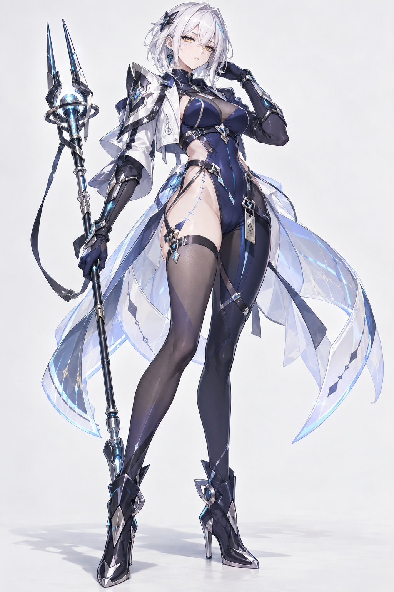

# Anime Character Director

**A Codex-native, human-in-the-loop Skill for designing original 2D anime / gacha character standees and maintaining character identity across controlled visual variations.**

**From generic AI anime characters to identity-driven contemporary gacha character design.**

## Visual Evolution

The same project evolved through several distinct design failures and corrections. These examples show why Anime Character Director is more than a prompt expander.

<table>
<tr>
<td align="center"><b>01 · Baseline</b></td>
<td align="center"><b>02 · Player Appeal V1</b></td>
<td align="center"><b>03 · Creative V2</b></td>
<td align="center"><b>04 · Current</b></td>
</tr>
<tr>
<td></td>
<td></td>
<td></td>
<td></td>
</tr>
<tr>
<td valign="top"><b>Generic convergence</b><br>Occupation-first design.<br>White-hair + techwear template.<br>Low character fantasy.</td>
<td valign="top"><b>Player appeal introduced</b><br>Stronger body framing and premium presence.<br>Still generic sci-fi gacha.</td>
<td valign="top"><b>Creativity unlocked</b><br>Original character premise.<br>But pagegame/MMORPG drift and twisted pose remain.</td>
<td valign="top"><b>Structure-driven design</b><br>Front-facing standee.<br>Cleaner contemporary gacha language.<br>Structural fantasy design.</td>
</tr>
</table>

> **Each failure became a design rule.**
>
> Anime Character Director was built by repeatedly identifying why a technically good anime image still failed as a memorable gacha character.

> The goal is not to maximize detail.
> The goal is to maximize identity.

## What changed?

### 01 → 02: Player appeal

The early system overvalued profession, plausibility and functional clothing.

The first major correction was simple:

**A playable gacha character is not an NPC wearing expensive equipment.**

Player fantasy, attraction, silhouette and emotional appeal became first-class design concerns.

### 02 → 03: Creative freedom

The next problem was AI conservatism.

The system was good at producing coherent characters, but coherence was suppressing imagination.

The philosophy changed to:

> **Codex expands. Human selects.**

AI explores unusual possibilities. Human judgment decides which direction deserves to survive.

This produced much stronger character premises, including the “future selves hunting the present self” concept.

### 03 → 04: Art-direction discipline

Creative concepts alone were not enough.

The third version exposed two new problems:

- browser-game / MMORPG visual drift
- cinematic 3/4 twisted poses

The Skill therefore added:

- Front-Facing Standee Principle
- Contemporary Gacha Design Principle
- Macro-first design
- Detail Islands
- Color / Material Architecture
- Structural Fantasy Design
- One Primary Iconic Anchor

The result is cleaner, more readable, more character-specific, and closer to contemporary anime gacha standee design.

Current iteration significantly improves:

- frontal readability
- contemporary gacha language
- controlled detail density
- structural fantasy expression

Identity refinement remains an active area of development. We are still researching stronger head identity, costume-specific identity, and deeper integration of fantasy mechanics into the body / outfit.

## What problem it solves

Modern image models can render polished anime illustrations, but character design often converges toward generic anime faces, repeated white-hair/techwear templates, browser-game or MMORPG visual language, ornament density instead of identity, cinematic 3/4 poses instead of readable standees, and safe predictable concepts.

Anime Character Director adds a design layer before image generation. It is not a prompt expander. It guides possibility expansion, Character Direction exploration, Human selection, Art Direction exploration, Human mix/selection, contemporary gacha visual language, front-facing standee composition, and anime 2D style preservation.

## Codex expands. Human selects.

```text
User Idea
    ↓
5 Character Directions
    ↓
Human Select / Mix
    ↓
Character Planning
    ↓
4 Art Directions
    ↓
    Human Select / Mix
    ↓
    Visual Preference Sheet
    ↓
    Human Select / Mix / Custom / Delegate
    ↓
    Human Audit + Visual Preferences Locked
    ↓
    Final Visual Direction
    ↓
$imagegen
    ↓
S1 Anime 2D Hard Gate
    ↓
Human Review
```

AI does not automatically decide taste. Human owns selection, rejection, mixing, aesthetics, and the question: “would I pull this character?”

## Human Mix

Mixing is a first-class workflow, not an exception. For example, a human may keep **B's silhouette**, take **D's head identity**, preserve **A's material language**, and introduce **C's fantasy intrusion**. The Skill treats that combination as the approved direction and carries it forward without silently normalizing it.

## Major design features

### Character Design

Design original adult 2D anime/gacha characters from premise, identity, silhouette, costume architecture, fantasy logic, and player-facing appeal.

### Human-Guided Creative Expansion

Interactive CREATE expands 4–6 Character Directions by defaulting to five, then presents 4–6 Art Directions by defaulting to four. It pauses at Human selection checkpoints and does not silently choose taste.

### Standee-First Art Direction

The default deliverable is a clear, recognizable, reusable character standee. Character identity comes before cinematic presentation; scene-heavy art is an explicit extension.

### Front-Facing Standee

The main body stays readable from the front for standard standees. Dynamism comes from arms, hair, cloth, weapons, effects, asymmetry, and controlled weight shifts rather than unreadable torso rotation.

### Contemporary Gacha Design

Identity comes before pagegame luxury: macro shapes, head identity, costume architecture, detail islands, controlled color architecture, material hierarchy, and one primary iconic anchor.

### Identity Pass

The lightweight Identity Pass turns a selected direction into a specific woman before generation and records what must remain recognizable.

### Character Canon

Human-approved Canon and a Master Reference anchor later visual variations without silently redesigning the character.

### Same-Character Standee

Canon-preserving portraits, half bodies, expressions, front/side/back references, and standee pose variants keep identity stable across presentations.

### Variants

Controlled hair, expression, pose, costume, legwear, footwear, color, silhouette, accessory, and fantasy-structure variations remain branchable and Human-selectable.

`standee_pose_variant` is the pose-focused subtype inside `variants`: four text-only standing-pose options come first, Human chooses or mixes, and only then is the selected standee generated.

### Anatomy Integrity

Post-generation technical QA separates visible anatomy failures from aesthetic preferences and keeps repairs bounded to anatomy.

### Human Authority

AI expands, compares, critiques, and recommends; Human selects, mixes, approves, rejects, and decides Canon.

### Optional Presentation Extensions

Promotional key art, combat art, ultimate art, story illustration, and cinematic compositions are supported only when explicitly requested. They are not additional modes or the default product scope.

## Installation

This repository is itself the Skill root. Clone or download it into the user-level Codex Skills directory; do not add an extra `skills/anime-character-director/` nesting layer.

### Git clone

```powershell
git clone https://github.com/glt258/anime-character-director.git "$HOME\.codex\skills\anime-character-director"
```

On Windows, use the user-level Skills directory, for example:

```powershell
git clone https://github.com/glt258/anime-character-director.git "%USERPROFILE%\.codex\skills\anime-character-director"
```

### Download ZIP

Download the repository ZIP, extract it, and place the extracted `anime-character-director` folder in the user-level Skills directory used by your Codex installation.

## Quick start

```text
$anime-character-director

Design an original adult female anime gacha character.

I want:
- urban fantasy
- dangerous but elegant
- strong player appeal

Use `USER_DECIDE` mode.
Do not choose the Character or Art direction for me.
```

The Skill stops at the Character Direction and Art Direction gates, then presents one consolidated Visual Preference Sheet. Each user selection resumes the same persisted session automatically. Only a fully resolved direction proceeds through the local Runtime → PromptCompiler boundary.

## Runtime and boundaries

This package is the reusable Codex Skill layer. It bundles the human-readable Anime Style Constitution, machine-readable style policy, Visual Preference runtime gate, preference schema, report format, and focused tests. It does not bundle an external Agent, server, LLM API wrapper, image API, or ComfyUI pipeline. A host project may add a larger Runtime preflight around the bundled ownership gate.

The current runtime preserves the S1 Anime 2D, Regional Style, Lower-Body, Leg Separation, Pose Intent, and Playable Character Design contracts. Interaction System v1 ends at `GENERATION_READY`; it does not call `$imagegen` or generate images. After a later generation, present the image and stop for Human Review; do not automatically redesign, regenerate, optimize, or score commercial appeal.

## Change Reporting Contract

Every development response states, briefly and in plain Chinese: **这次在干什么**, **为什么要改**, **这次具体改了什么**, **这次没动什么**, **检查结果**, **现在项目到哪了**, and **下一步**. Explain the effect before file names, and translate technical English on first use when useful. This keeps the Human informed about scope and state; it does not create a new runtime gate.

## Image generation

Anime Character Director is designed to work with Codex built-in `$imagegen`. It does not require an external image API, ComfyUI, or an external Agent server. `$imagegen` is the renderer, not the Character Designer; character design happens before image generation.

## Current Status

Pose System v1 is `ACCEPTED / FROZEN` for the current fast-generation production baseline. See [Pose System v1 Acceptance](docs/POSE_SYSTEM_V1_ACCEPTANCE.md). This is an accepted baseline, not a claim that every future pose problem is completely solved; detailed pose refinement remains a separate future mode.

Interaction System + Three Creation Modes v1 is `THREE_MODE_INTERACTION_SYSTEM_V1_ACCEPTED` / `ACCEPTED / FROZEN`. `QUICK`, `AI_DECIDE`, and `USER_DECIDE` share one persisted pipeline; the natural-language layer is `INTERACTION_NL_V1_ACCEPTED`; all flows stop at `GENERATION_READY` without image generation. See [Three-Mode Interaction System v1 Acceptance](docs/THREE_MODE_INTERACTION_V1_ACCEPTANCE.md).

Implemented: Standee-first product scope; Anime 2D Hard Gate guidance; three-mode Interaction System; Human-guided Character and Art Direction expansion; Human selection and mixing; Design Ownership Policy; Visual Preference Gate; Visual Preference Sheet and report; Visual Diversity Control; Human Audit Policy; Front-Facing Character Standee guidance; Contemporary Gacha Design Principle; Identity Pass; Character Canon; Same-Character Standee; controlled Variants including four-direction `standee_pose_variant` planning; Anatomy Integrity; Human Authority; Optional Presentation Extensions; Macro-first design; Detail Islands; Color Architecture; Material Hierarchy; Structural Fantasy Design; One Primary Iconic Anchor; plain-Chinese Change Reporting Contract; and Codex built-in `$imagegen` integration.

The historical Commercial Gacha Visual Profile remains vocabulary/reference material. The runtime Gacha Rendering Style Gate now has Global and Regional stages; both must pass before `STYLE_VALID`.

## Disclaimer

This project is an independent AI-assisted character-design tool. It is not affiliated with, endorsed by, or associated with HoYoverse, miHoYo, Zenless Zone Zero, or any other commercial game studio or title. The example images are AI-generated development examples. The Skill is intended for original character creation.

## Repository layout

```text
anime-character-director/
├─ SKILL.md
├─ README.md
├─ LICENSE
├─ agents/
│  └─ openai.yaml
├─ config/
│  └─ anime_style_policy.yaml
├─ schemas/
│  └─ visual_preference_sheet.schema.json
├─ runtime/
│  ├─ interaction_runtime.py
│  ├─ natural_language_interaction.py
│  └─ visual_preference_runtime.py
├─ docs/
│  ├─ ANIME_STYLE_CONTRACT.md
│  ├─ INTERACTION_SYSTEM.md
│  └─ THREE_MODE_INTERACTION_V1_ACCEPTANCE.md
├─ references/
│  ├─ character-design-guide.md
│  └─ workflow.md
├─ examples/
│  ├─ basic.md
│  └─ advanced.md
├─ assets/
│  ├─ evolution-01-baseline.png
│  ├─ evolution-02-player-appeal-v1.png
│  ├─ evolution-03-pagegame-drift.png
│  └─ evolution-04-current.png
└─ scripts/
   └─ README.md
```

## License

MIT. See [LICENSE](LICENSE).
