# anime-character-director

`A Codex Skill for designing and generating commercial anime / gacha game characters.`

面向现代商业二次元游戏角色设计与立绘生成的 Codex Skill。

> One Skill. Three creation modes. From a character idea to a finished commercial anime/gacha illustration with Codex `$imagegen`.

**Current release: `v1.2.0` · `ANIME_CHARACTER_DIRECTOR = RELEASED`**

Anime Character Director turns a character idea into a coherent, production-oriented 2D anime-game character design. After the selected mode resolves the design and the local Runtime validates it, the Skill hands the result to Codex built-in `$imagegen` and runs the existing technical quality audit.

## Gallery

The current release gallery uses four diverse primary results from Generation Quality Benchmark v2: urban fantasy, dynamic mechanical, non-human, and warm memory/archive directions.

| USER_DECIDE replay / urban fantasy | AI_DECIDE / mechanical action |
|---|---|
| 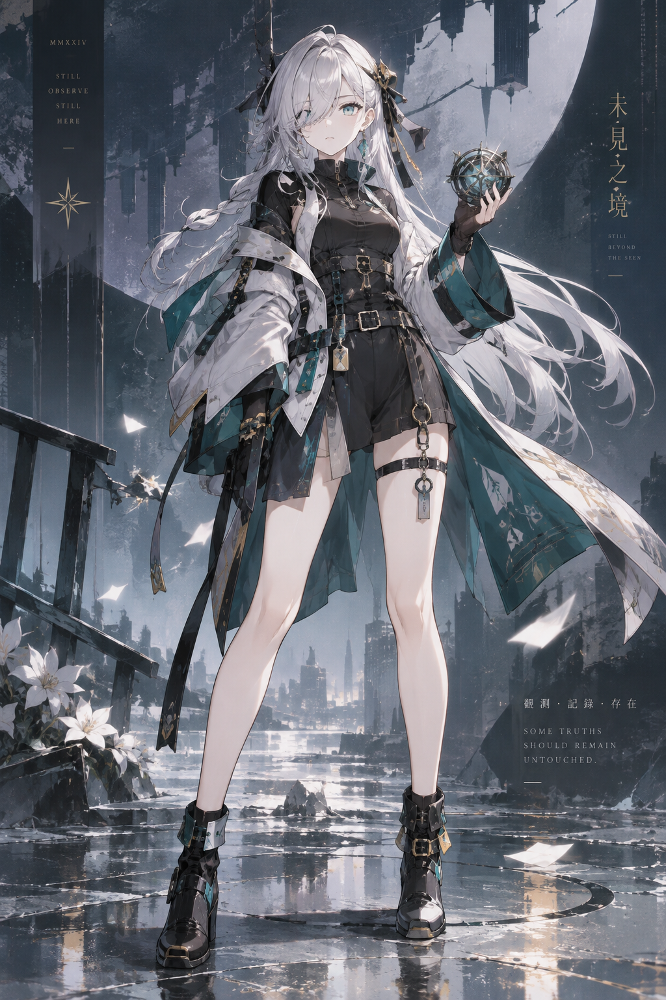 | 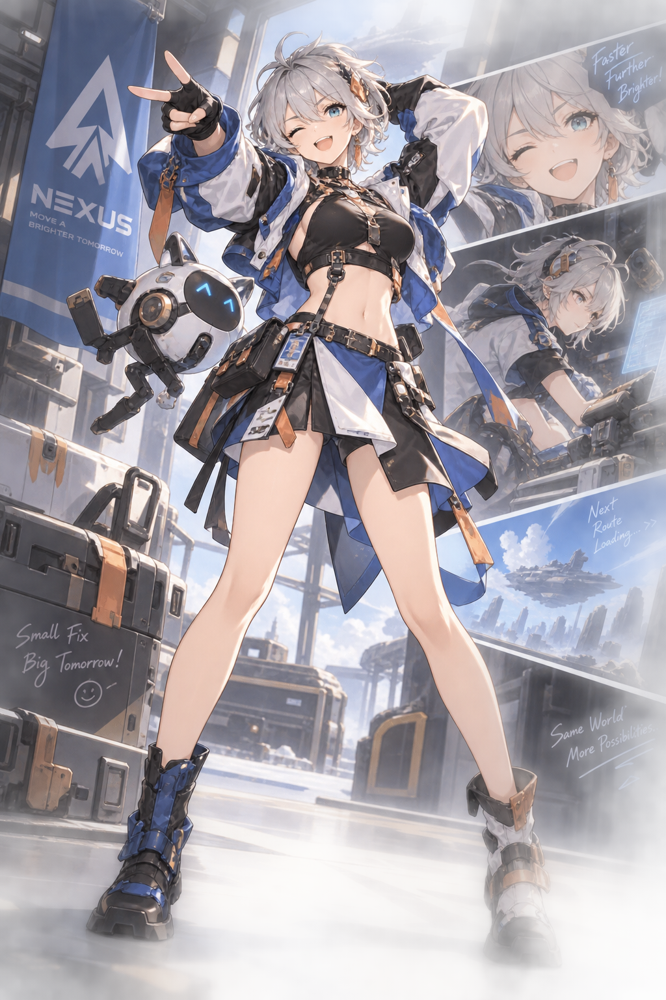 |
| USER_DECIDE replay / non-human | USER_DECIDE replay / warm memory |
| 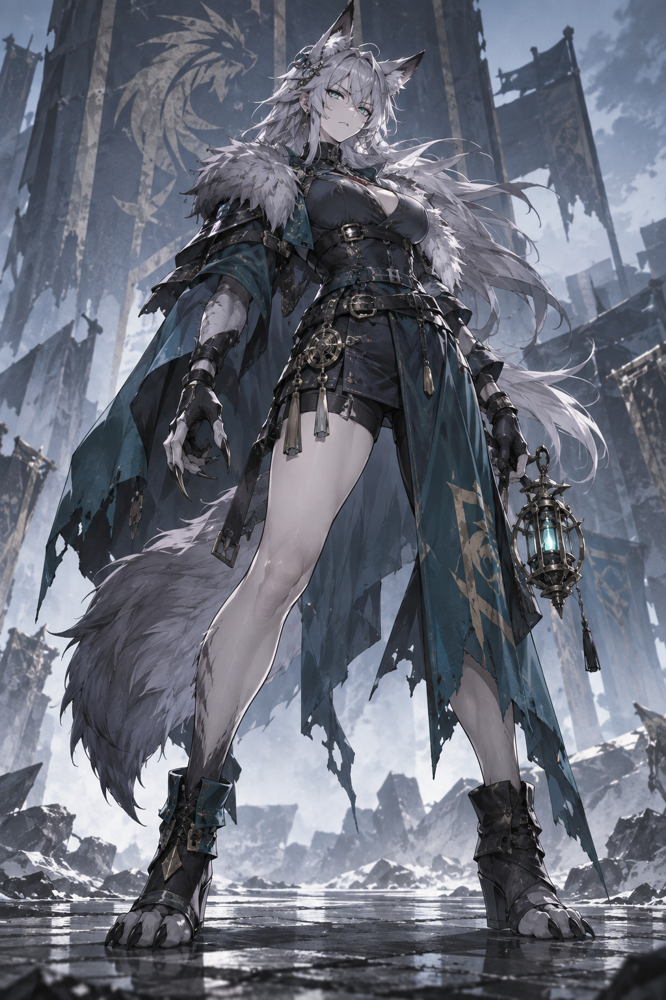 | 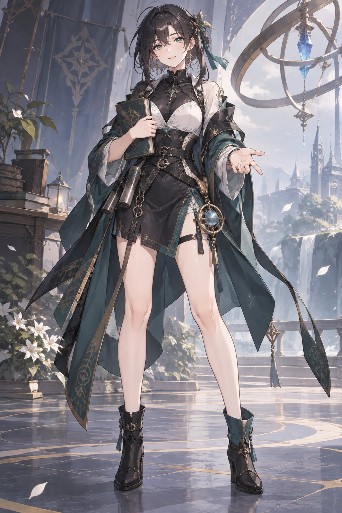 |

These are benchmark artifacts selected for visual range, not a claim that one mode wins every category.

## From Template Collapse to Structured Diversity: Before/After Showcase

When the same request went through `AI_DECIDE`, `QUICK`, and `USER_DECIDE`, the old pipeline still converged on similar long hair, curved horns, sexy footwear, hand-near-face poses, and gothic spaces despite the different decision flows. This exposed design-space collapse rather than a rendering-only problem.

**Shared request**

```text
画一个魅魔角色，要求有魅魔角，体现魅力，性感暴露但是不涉黄
```

### Before — Different modes, same visual attractor

These three images are real outputs from the same human acceptance test; they document cross-mode template convergence before the fix.

| AI_DECIDE | QUICK | USER_DECIDE |
|---|---|---|
| 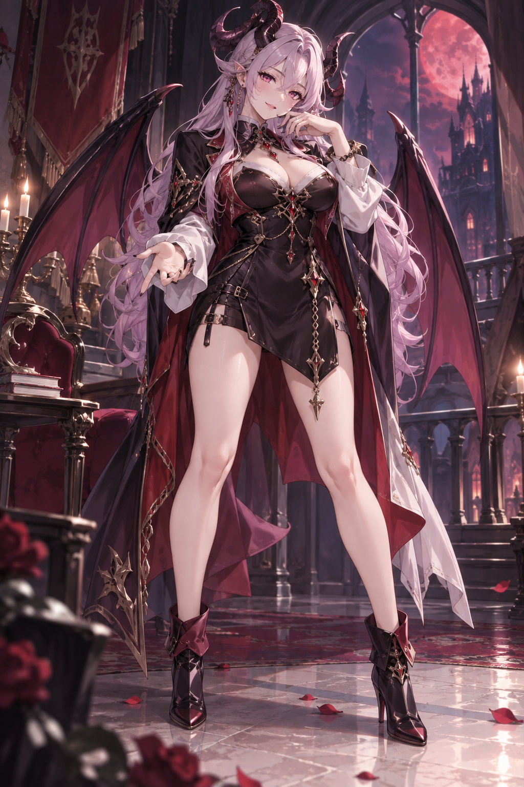 | 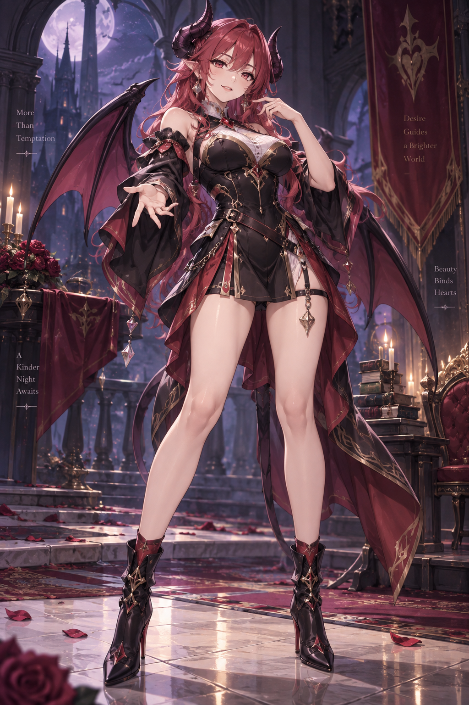 | 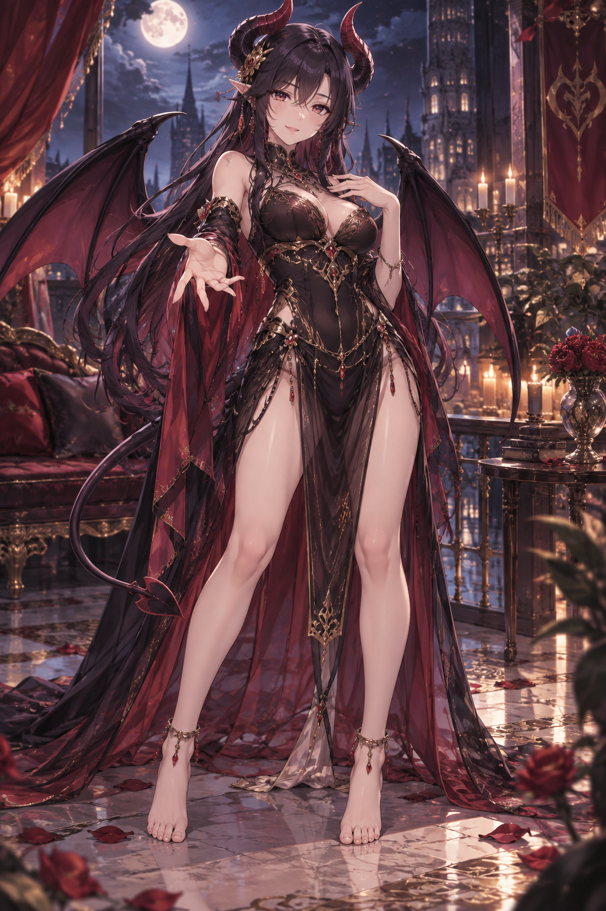 |

### After — Structured visual divergence

The new `DesignDNA + PoseDNA + BackgroundDNA` pipeline separates high-level character identity from executable structural fields, allowing one semantic request to produce multiple structurally valid visual solutions.

| P1 | P2 | P3 strict E2E | Repaired P4 |
|---|---|---|---|
| 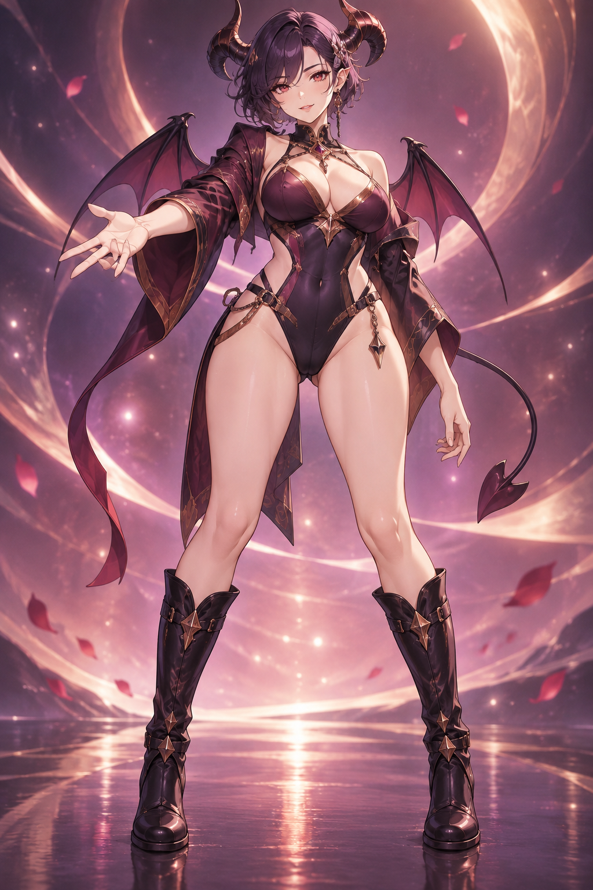 | 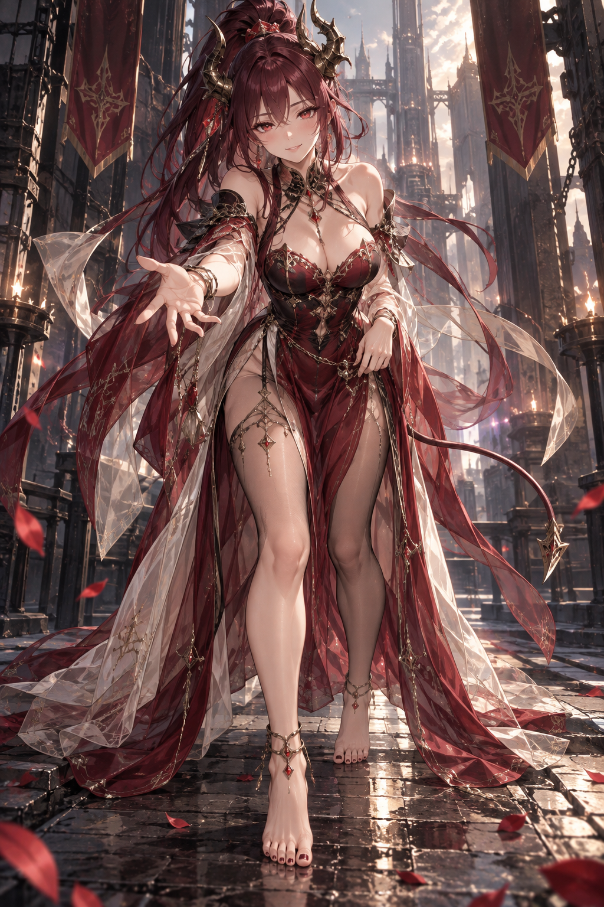 | 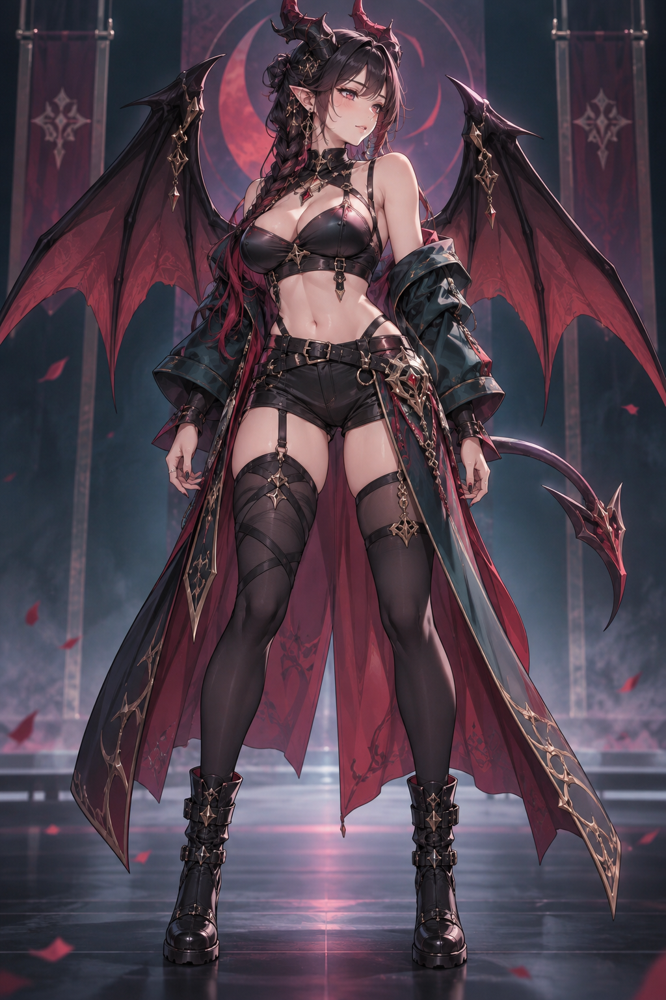 | 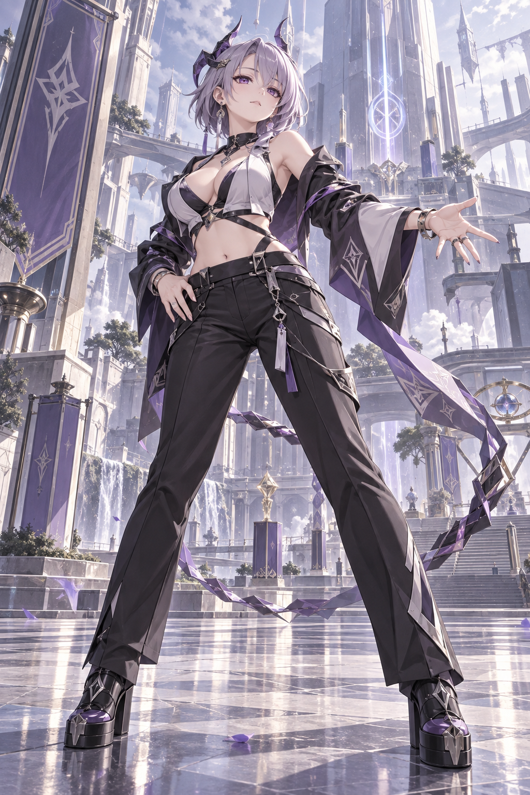 |
| Short side-sweep hair · tall flat boots · plum/copper · open stance | High ponytail · barefoot ankle jewelry · oxblood/ivory · forward step | Braided medium side mass · combat boots · deep teal/crimson · relaxed low hands · minimal stage | Layered bob · tailored trousers · platform footwear · violet/graphite · repaired architecture |

Together, these results show differences in hairstyle, horn topology, costume and lower-body structure, footwear category, upper-body action, pose, wing vocabulary, and background space. The system aims to reduce structural repetition, detect cross-run design collisions, preserve explicit visual constraints, and support targeted repair of failed fields; it does not guarantee that every generation will be completely different or fully compliant.

This is not merely a negative-prompt patch. The current pipeline separates character design, cross-run novelty checking, visual specification constraints, post-generation QA, and targeted repair:

```text
Fresh Run
→ Context Firewall
→ Structured DesignDNA
→ CrossRunNoveltyGuard
→ Visual Specification Contract
→ Image Generation
→ Visual Adherence Critic
→ Targeted Repair
```

All images are existing real acceptance artifacts; `P3 strict E2E` used the complete `PromptBundle.prompt`, and `Repaired P4` is the final artifact after repair.

## What is anime-character-director?

It is one Codex Skill for original commercial 2D anime/gacha character creation. It is not an independent Agent, server, external LLM wrapper, or image API.

The Skill helps with character identity, silhouette, costume architecture, pose, species read, explicit constraints, visual direction, and final illustration generation. The default visual language is `contemporary commercial gacha anime`, not generic anime, photorealism, western realism, or a generic 3D-render aesthetic.

## Three Creation Modes

### QUICK

`Fastest path from idea to image.`

Give the Skill a character brief. It automatically fills the design, compiles the prompt, calls `$imagegen`, and runs the quality audit with minimal interaction.

Best for quick concepts, brainstorming, and fast first images.

Example: “设计一个冷静的都市幻想少女，QUICK 模式直接生成。”

### AI_DECIDE

`Full design reasoning, with the AI making the design decisions.`

The Skill runs the full Character Direction, Art Direction, and Visual Preference pipeline, generates contextual options, and makes the unresolved design decisions automatically before calling `$imagegen`.

Best when you want more complete design reasoning without selecting every checkpoint. In Generation Quality Benchmark v2, AI_DECIDE achieved the strongest overall average quality; it does not always win every dimension.

### USER_DECIDE

`Co-design the character through Codex native interactive UI.`

USER_DECIDE uses Codex `request_user_input` for native selectable options. It supports `Other` / Custom, recommendation acceptance, delegation, BACK, and restart continuation while preserving one persistent workflow. After each click, the Skill advances automatically.

The normal flow does not require typing `A/B/C`, `SELECT`, `continue`, `resume`, or a session id.

Best when you have strong preferences about hair, palette, outfit, pose, footwear, body language, or non-human traits.

## Quick Start

Use the Skill directly in Codex; this repository does not define a separate CLI.

### QUICK

```text
Use anime-character-director in QUICK mode to design and generate a cyber-fantasy girl character.
```

```text
用 anime-character-director 的 QUICK 模式设计一个冷静的都市幻想少女，直接生成最终立绘。
```

### AI_DECIDE

```text
Use anime-character-director in AI_DECIDE mode. Design a fast-moving engineer-themed girl, but avoid literal mechanic props.
```

```text
用 anime-character-director 的 AI_DECIDE 模式设计一个高速行动的工程师主题少女，但不要把职业字面化成扳手和工具。
```

### USER_DECIDE

```text
Use anime-character-director in USER_DECIDE mode. I want to co-design a non-human female character.
```

```text
用 anime-character-director 的 USER_DECIDE 模式设计一个非人女性角色，我想逐步参与选择。
```

USER_DECIDE 的可见流程是：

```text
User Prompt
    ↓
Character Direction
    ↓
Codex Native Selection UI
    ↓
Art / Visual Direction
    ↓
Visual Preferences
    ↓
Validated Prompt
    ↓
Codex built-in $imagegen
    ↓
Post-generation Quality Audit
```

## Generation Quality Benchmark v2

Generation Quality Benchmark v2 is internal release evidence with status `COMPLETE_WITH_REPLAYED_USER_DECIDE_DISCLOSURE`.

- `12 / 12` comparable primary generations completed.
- Four characters × three modes: QUICK, AI_DECIDE, USER_DECIDE.
- The runtime freeze remained unchanged; no benchmark regeneration was used.
- `0 / 12` crossed-leg default.
- `0 / 12` black stockings.
- `0 / 12` high heels.
- `0 / 12` soft-girl template collapse.
- Character C non-human constraint failure: `0 / 3`.
- `4 / 12` images had hands that could not be fully audited because of occlusion; occlusion was not counted as PASS.

Mode conclusion: AI_DECIDE achieved the highest overall average; higher-intervention USER_DECIDE rows showed stronger Identity / Pose in B/C; low-intervention USER_DECIDE on D was close to AI_DECIDE; no single mode won every category.

The final comparison used fresh autonomous QUICK / AI_DECIDE runs. USER_DECIDE rows use previously recorded real-human selections replayed under the frozen benchmark runtime. They are not four new live USER_DECIDE sessions. Native UI authenticity is separately covered by `NATIVE_INTERACTION_UI_HUMAN_ACCEPTANCE_V1` evidence and runtime tests.

LoRA conclusion: `LORA_NOT_PRIMARY_BOTTLENECK`. The benchmark does not support the claim that simply continuing to step1000 will solve the main issues; it also does not claim that step500 or current LoRA training is perfect or finished forever.

See the [full Benchmark v2 Summary](docs/BENCHMARK_V2_SUMMARY.md). The detailed benchmark report remains an internal workspace artifact and is intentionally not required for GitHub users.

## What v1 Solves

### Commercial anime style lock

The default contract is `contemporary commercial gacha anime`, with anime abstraction, readable silhouette, character-specific costume architecture, controlled materials, and a commercial playable-character presentation.

### Native interaction and persistent workflow

USER_DECIDE uses Codex native UI. The workflow supports restart continuation, BACK, Custom / Other, recommendation acceptance, delegation, stale-answer protection, and one persistent `WorkflowRun` without exposing internal ids to normal users.

### Explicit constraints

The system preserves positive constraints, prohibited attributes, atomic prohibitions, compound prohibitions, archetype prohibitions, pose, footwear, and species constraints.

For example, `不要粉色长发` means:

```text
avoid pink long hair
NOT (pink AND long hair)
```

It does not become `no pink + no long hair`, and it does not create positive `hair_color` or `hair_style_family` fields.

### Pose and footwear de-template

The default does not force crossed legs, black stockings, or high heels. Footwear and legwear remain character-design variables rather than automatic genre shortcuts.

### Non-human character design

Non-human characters may change silhouette, anatomy, body mass, limbs, feet, tail, and species read. The target is not merely “human girl + ears + tail”.

### Post-generation anatomy audit

After generation, the quality audit checks visible fingers, hands, thumbs, palms, wrists, arm connections, limbs, torso continuity, legs, ankles, feet, and object grip. Occlusion may produce `NOT_FULLY_AUDITABLE`; it cannot silently become PASS.

## Known Limitations

- Human character design still shows some visual-prior and template bias.
- Silver / white hair appears more often than desired.
- Open standing poses remain common.
- Short boots and exposed-leg silhouettes remain relatively frequent.
- Some splash-art compositions rely heavily on background montage or generated signage.
- Hand anatomy can be difficult to fully audit when occluded.
- High-level interaction does not automatically eliminate base-model visual priors.

These are known post-v1 research limits, not hidden failures or v1 blockers.

## Architecture

```text
Codex
  ↓
anime-character-director Skill
  ↓
Mode Router
  ├─ QUICK
  ├─ AI_DECIDE
  └─ USER_DECIDE
       ↓
   Native Interaction UI
  ↓
Character Design Runtime
  ↓
Constraint System
  ↓
Prompt Compiler
  ↓
Codex built-in $imagegen
  ↓
Post-generation Quality Audit
```

The local Runtime owns validation, persistence, constraints, candidate resolution, PromptCompiler handoff, and fail-closed technical boundaries. The Skill orchestration owns the user-facing mode flow and the later `$imagegen` handoff.

## Quality and Safety Boundaries

- Anime 2D style remains the sole visual style hard gate.
- Explicit user requirements outrank recommendations and defaults.
- Technical anatomy failures can block delivery or enter bounded repair; aesthetic disagreement remains Human-owned.
- No external Agent, LLM API, image API, or ComfyUI pipeline is required.
- The Skill never targets a named existing character, game, artist, or recognizable style.

## Installation

This repository is itself the Skill root. Clone or download it into the user-level Codex Skills directory; do not add another `skills/anime-character-director/` nesting layer.

```powershell
git clone https://github.com/glt258/anime-character-director.git "%USERPROFILE%\.codex\skills\anime-character-director"
```

## Documentation

- [Skill contract](SKILL.md)
- [Three-mode interaction guide](references/creative-modes.md)
- [Persistent interactive workflow](docs/PERSISTENT_INTERACTIVE_WORKFLOW.md)
- [Interaction architecture](docs/INTERACTION_SYSTEM.md)
- [Anatomy integrity contract](references/anatomy-integrity.md)
- [Pose system acceptance](docs/POSE_SYSTEM_V1_ACCEPTANCE.md)
- [Benchmark v2 Summary](docs/BENCHMARK_V2_SUMMARY.md)
- [Post-v1 roadmap](wiki/roadmap/current.md)
- [Changelog](CHANGELOG.md)

## Evolution: From Early Prototype to Current Release

These historical images are intentionally separate from the current Gallery. They document why the Skill added commercial style lock, stronger identity, pose/footwear diversification, native interaction, and compound explicit constraints.

| Early prototype | Pre-v1 current sample |
|---|---|
| 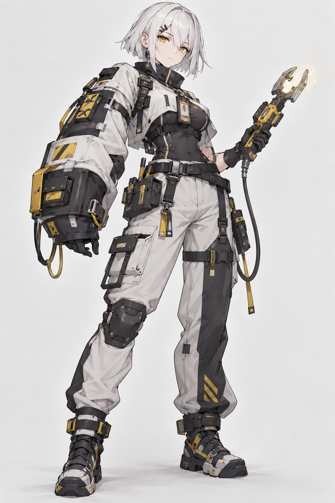 | 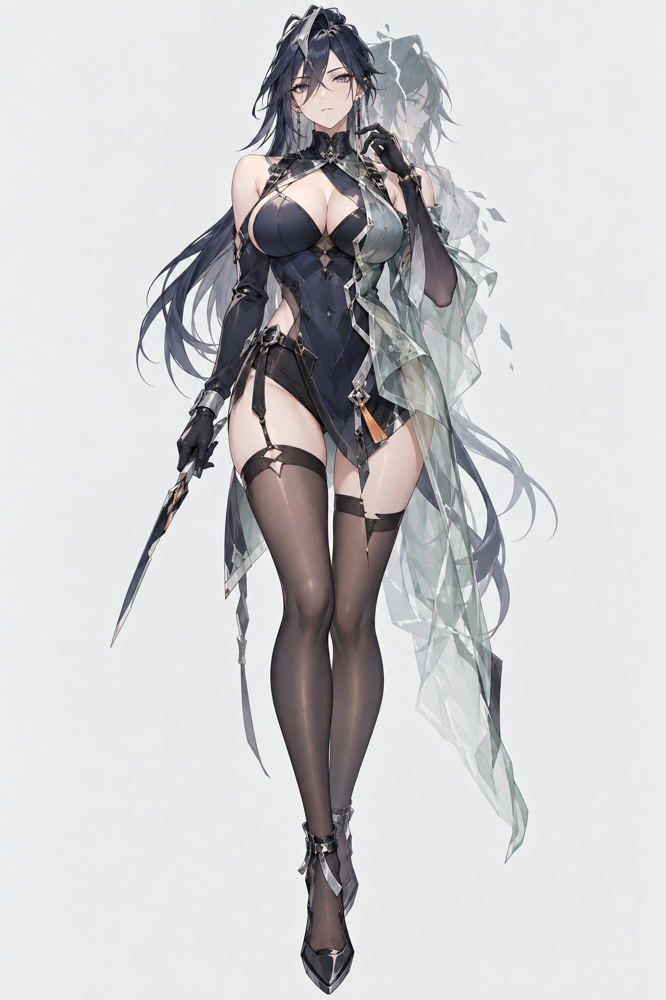 |
| Occupation-first literalization and equipment-heavy identity. | Stronger presentation, but visible black-stocking / high-heel and pose-template bias. |

The current release Gallery above is the public comparison point: commercial gacha language, native interactive workflow, stronger non-human design, de-templated pose/footwear rules, and compound explicit constraints.

## Roadmap

The current release is stable. Post-v1 research includes silver/white-hair bias, human-character diversity, outfit-template bias, pose vocabulary expansion, face diversity, splash-montage shortcuts, controlled LoRA step1000 evaluation, and a broader 20–30 character diversity benchmark.

## License

MIT. See [LICENSE](LICENSE).
